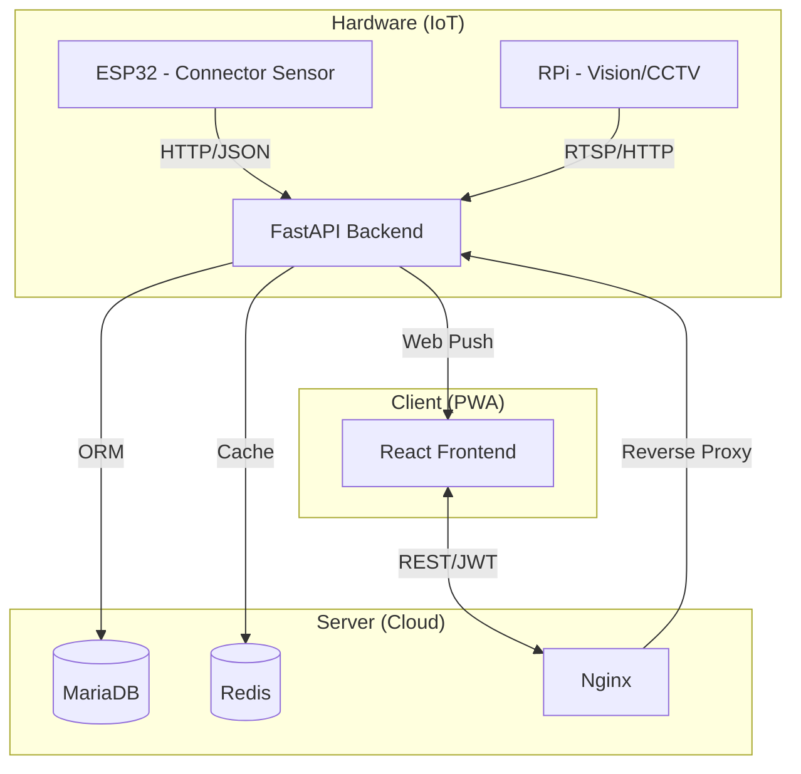

# 🔌 비움 (VIUM): 스마트 전기차 충전 관리 시스템
> **"비움으로 채우는 여유, 스마트 전기차 충전 솔루션"**

[](https://github.com/marin3262/vium)
[](https://vium-project.duckdns.org)

**비움(VIUM)**은 전기차 충전소의 장기 점유 문제와 '고스트 데이터(Ghost Data)' 문제를 해결하기 위해 IoT 센서와 AI 비전 인식을 결합한 스마트 관제 및 보상 시스템입니다. 사용자의 매너 있는 충전 문화를 독려하고, 실시간 데이터를 통해 충전 효율을 극대화합니다.

---

## ✨ 주요 기능 (Key Features)

### 1. 실시간 스마트 관제 (Map-based Monitoring)
- **카카오 맵 API 연동**: 양주시를 중심으로 수백 개의 충전소 데이터를 실시간 동기화하여 시각화합니다.
- **지능형 필터링**: 급속/완속, 가용 상태, 거리순 정렬 등 사용자 맞춤형 탐색 기능을 제공합니다.
- **사일런트 업데이트**: 3초 주기 데이터 폴링 시에도 화면 깜빡거림 없는 매끄러운 UX를 보장합니다.

### 2. IoT 기반 이중 교차 검증 (Dual-Sensor Verification)
- **하드웨어 융합**: 아두이노(홀 센서)의 커넥터 연결 신호와 라즈베리파이(OpenCV/YOLO)의 비전 인식을 결합합니다.
- **알박기 방지**: 차량은 있으나 충전은 하지 않는 '점유 상태'를 정확히 식별하여 관리자에게 알립니다.
- **지능형 세션 매핑**: 다중 사용자 환경에서도 실제 커넥터를 소유한 유저에게만 충전 트리거를 전달합니다.

### 3. 게이미피케이션 보상 체계 (Eco-Reward System)
- **80% 충전 보너스**: 배터리 수명을 고려한 80% 충전 완료 시 추가 마일리지를 지급합니다.
- **매너 출차 보상**: 충전 완료 후 10분 이내 출차 시 보너스 포인트를 지급하여 회전율을 높입니다.
- **신뢰도 등급제**: 활동 지수에 따른 Trust Score(0-100)를 관리하여 보상 배율을 차등 적용합니다.

### 4. 커뮤니티 기반 고장 제보 (Community Governance)
- **이미지 압축 업로드**: 고해상도 제보 사진을 클라이언트 단에서 압축하여 서버 부하를 줄이고 데이터 영속성을 확보합니다.
- **관리자 관제**: 제보된 사진을 관리자가 승인/반려하고, 그에 따른 유저 신뢰도 및 보상을 원자적으로 처리합니다.

### 5. 심리스한 결제 및 알림 (Payment & Notification)
- **토스페이먼츠 v2**: 카드 결제 및 마일리지 복합 결제를 지원하는 최신 SDK를 적용했습니다.
- **Web Push (PWA)**: 별도 앱 설치 없이도 충전 시작, 80% 도달, 완료, 출차 등 전 과정을 푸시 알림으로 수신합니다.

---

## 🛠 기술 스택 (Tech Stack)

### Frontend
- **Framework**: React 19 (TypeScript)
- **Build Tool**: Vite
- **State Management**: Zustand
- **Styling**: Tailwind CSS 4
- **Maps/GPS**: Kakao Maps API, Kakao Mobility SDK

### Backend
- **Framework**: Python FastAPI
- **ORM**: SQLAlchemy
- **Database**: MariaDB (Relational), Redis (Real-time/Cache)
- **Auth**: JWT (JSON Web Token), OAuth2
- **Communication**: REST API, Web Push (VAPID)

### Infrastructure & IoT
- **Cloud**: KT Cloud (Debian 11)
- **Server**: Nginx, PM2, Docker
- **Security**: Let's Encrypt (HTTPS), DuckDNS
- **Hardware**: ESP32 (Arduino), Raspberry Pi 3 (OpenCV/YOLO)

---

## 🏗 시스템 아키텍처 (System Architecture)



---

## 🚀 시작하기 (Getting Started)

### Backend
```bash
cd vium-backend
python3 -m venv .venv
source .venv/bin/activate
pip install -r requirements.txt
python3 main.py
```

### Frontend
```bash
cd vium-web
npm install
npm run dev
```

---

## 📅 개발 이력 (Development Roadmap)

### Phase 1: 기반 설계 및 프로토타이핑 (2026.03)
- 시스템 아키텍처 설계 및 DB 스키마 정의
- IoT 하드웨어(Arduino) 및 비전 인식(OpenCV) 기초 알고리즘 개발
- React 기반 반응형 UI 레이아웃 구축

### Phase 2: 핵심 모듈 통합 및 데이터 고도화 (2026.04)
- FastAPI 백엔드 구축 및 REST API 설계
- SQLite에서 MariaDB 및 Redis로 인프라 마이그레이션
- 양주시 실제 충전소 공공데이터 동기화 엔진 구축

### Phase 3: 보안 및 인프라 상용화 (2026.05)
- JWT 기반 인증 시스템 및 RBAC 권한 관리 도입
- KT Cloud(Debian) 서버 환경 구축 및 SSL(HTTPS) 적용
- 토스페이먼츠 v2 결제 모듈 및 웹 푸시(VAPID) 알림망 연동

### Phase 4: 시스템 최적화 및 최종 검증 (2026.06)
- 모바일 100dvh 대응 및 시네마틱 충전 UI 리팩토링
- 하드웨어-소프트웨어 실시간 상태 전이 로직 무결성 확보
- 고장 제보 이미지 압축 및 관리자 관제 대시보드 고도화
